# Diagramas de flujo

##  Inicio / fin de un proceso, algoritmo o función
>Proceso nombreProceso
  	
FinProceso  
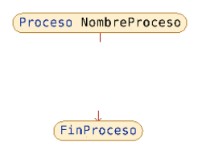

## Definir variables
>Definir variable como Entero  
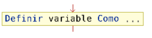

## Ejecución de un proceso
>a ← b + 5  
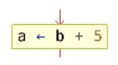

## Escribir en la salida
>Escribir 'mensaje' 
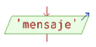

## Leer de la entrada
>leer variable  
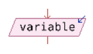

## Si - entonces
>Si expresion_logica Entonces 
acciones_por_verdadero 
SiNo 
acciones_por_falso 
Fin Si
 
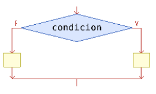

## Según sea
>Segun variable_numerica Hacer 
opcion_1: 
secuencia_de_acciones_1 
opcion_2: 
secuencia_de_acciones_2 
opcion_3: 
secuencia_de_acciones_3 
De Otro Modo: 
secuencia_de_acciones_dom 
Fin Segun 

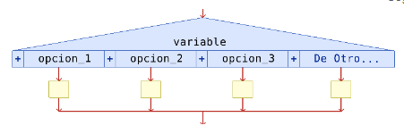

## Mientras - hacer
>Mientras expresion_logica Hacer 
secuencia_de_acciones 
Fin Mientras 
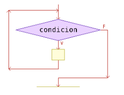

## Repetir hasta
>Repetir 
secuencia_d_acciones 
Hasta Que expresion_logica 
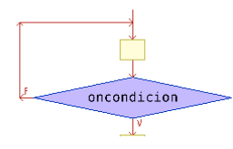

## Para - hasta - hacer
>Para variable_numerica<-valor_inicial Hasta valor_final Con Paso paso Hacer
	secuencia_de_acciones 
Fin Para 
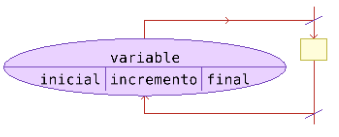

## Definición de subprocesos (no devuelven valores)
>SubProceso NombreSubproceso (Argumentos) 
FinSubProceso 
Proceso unProceso 
NombreSubproceso(5) 
FinProceso 
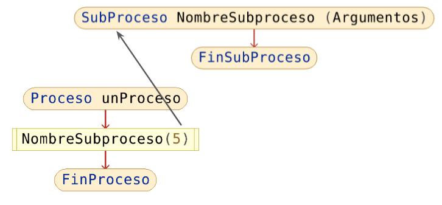

## Definición de subprocesos (si devuelven valores)
>SubProceso variable_de_retorno <- NombreSubproceso (Argumentos) 
	variable_de_retorno <- 5 
FinSubProceso 
Proceso unProceso 
	r <- NombreSubproceso(5) 
FinProceso 
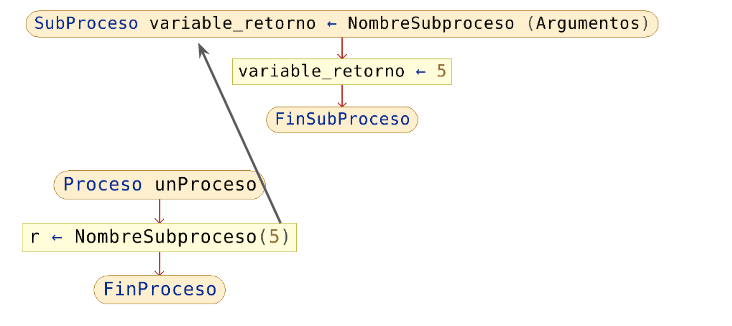

## Comentarios
>//comentario 
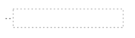
