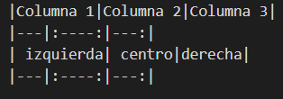
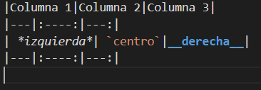

# Header1 con "#"
## Header2 con "##"
### Y así sucesivamente 

Título 1 subrayado con "==="
======

Título 2 -----
------

##  _Italica_
Para *italia* usamos  * asteriscos * o  _ guión bajo _

##  **Negrita**
Para **negrita** usamos ** doble asterisco ** o __ doble guión bajo __

## **_Italica_ + negrita**
Para **negrita e _italica_** combinada ** negrita e _ italica _ **

## ~~Tachado~~
para ~~tachado~~ usamos ~~ virgula ~~ (Alt Gr + 4)

## Lista numerada
1. Uno
2. Dos
3. Tres

Usamos 1. Lista

## Lista desordenada
- Uno
- Dos
- Tres

Usamos el guión (-), asterisco (*) o el más (+)

## Listas anidadas
1. lista 1
2. lista 1
    1. sub lista1
    2. sub lista2
* uno
    * dos
        * tres

## Enlaces

Para un enlace con atajo como [Google](www.google.es) usamos [....] (...)
Tambien pudes poner sólo en enlace www.google.es

## Imagenes

Inserta imágenes como esta de un perro usando ! [ alt text] ( enlace) 

Es posible aplicar imágenes como tags en html:
< img width="50%" src=perro.jpg>>


## Código
Es posible insertar código directamente con 3 comillas(```)+lenguaje + código + 3 comillas

```java

public class markdown{

public static void main(String[] args) {
    System.out.println("Hello world")
    
    }
}
```

## Tablas
Podemos hacer tablas como esta 
|Columna 1|Columna 2|Columna 3|
|---|:----:|---:|
| izquierda| centro|derecha|
|---|:----:|---:|

Así:
<br>


Las tablas admiten formatos como cursiva,negrita o resaltado
|Columna 1|Columna 2|Columna 3|
|---|:----:|---:|
| *izquierda*| `centro`|__derecha__|
|---|:----:|---:|

Así
<br>


## Blockquote

>Podemos crear un blockquote usando el mayor que (>).<br>
Escribimos todo lo que queramos
>> Para anidar blockquotes usamos (>>)
>>>Así hasta el infinito (>>>)

## HTML

<p>Es fácil añadir código html<p>
<p>un párrafo</p>
<a href="www.google.es">ir a google</a>
<dl>
  <dt>Una lista</dt>
  <dd>Un sublista</dd>

## Menciones

Usamo el @ para mencionar a alguien, como @pepe

## Listas de tareas
- [x] comprar pan
- [ ] ver pelicula con Paula
- [x] @mentions, #refs, [links](), **formatting**, y <del>tags</del>
- [x] otras tareas

## Emojis

puedes poner emojis como :dog: o :cat: