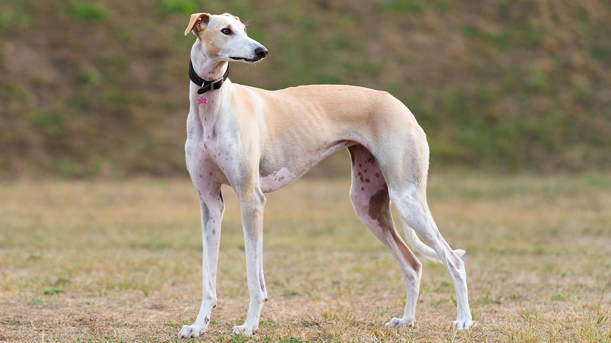

# Mi web de perritos

## Introducción

Nuestra página *web* muestra informacion sobre los tipos de **razas de perros** existentes. Somos una **_asociación_** amante de los animales. Fuck ~~maltrato~~ fuck sapos

# Razas principales
- pastor alemán
- pomerania
- pequinés
- doberman

# Cuidados principales
1. Alimento
2. Cariño
3. Aseo
4. Paseos

# Información extra :dog:

[ir a la wikiperria](https://es.wikipedia.org/wiki/Canis_familiaris)

# Un galgo



# Calendario de vacunación
- [ ] Semana 1
- [ ] Semana 2
- [ ] Semana 3

# Programa que ladra

```java
class ladra{
public static void main(String[]arg) {
    system.out.println("guau")
}

}
```


